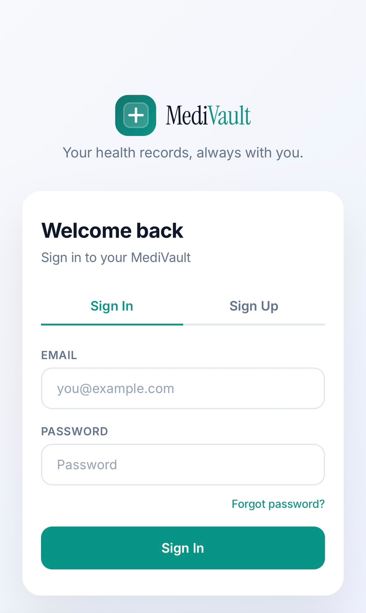
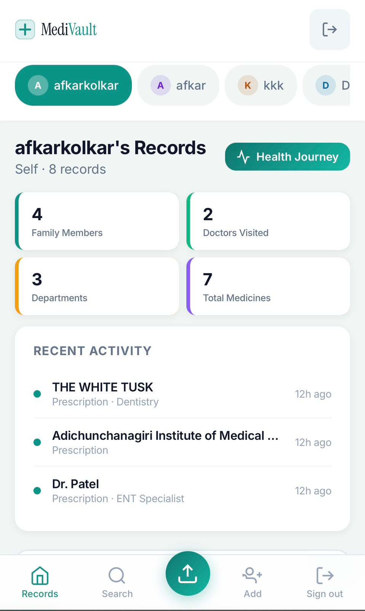
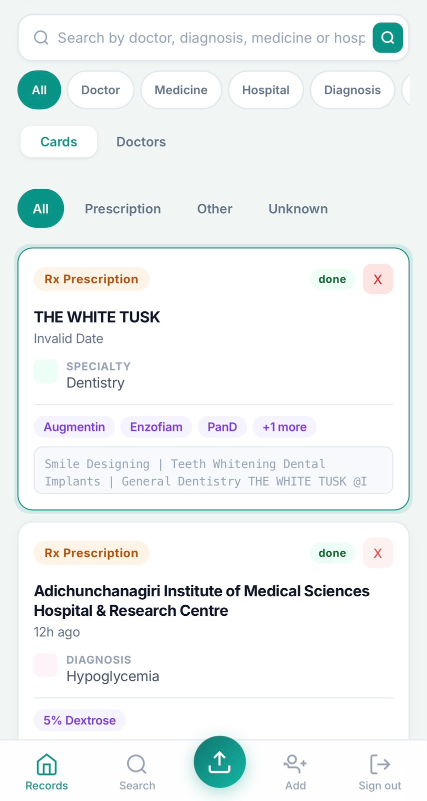
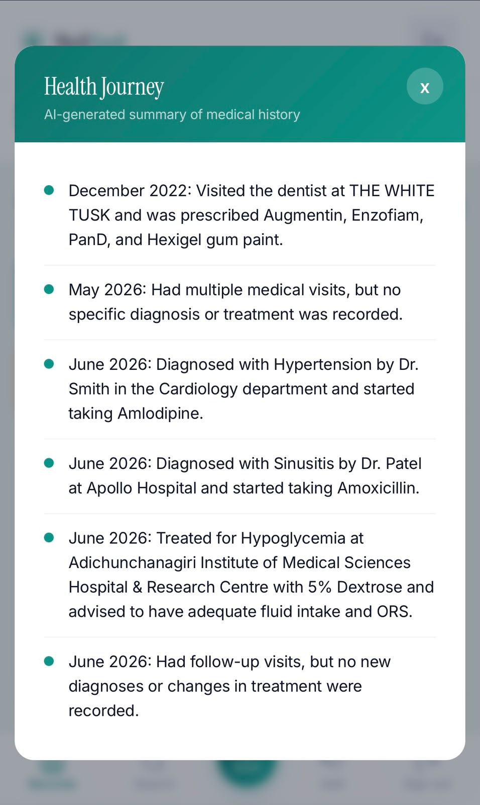
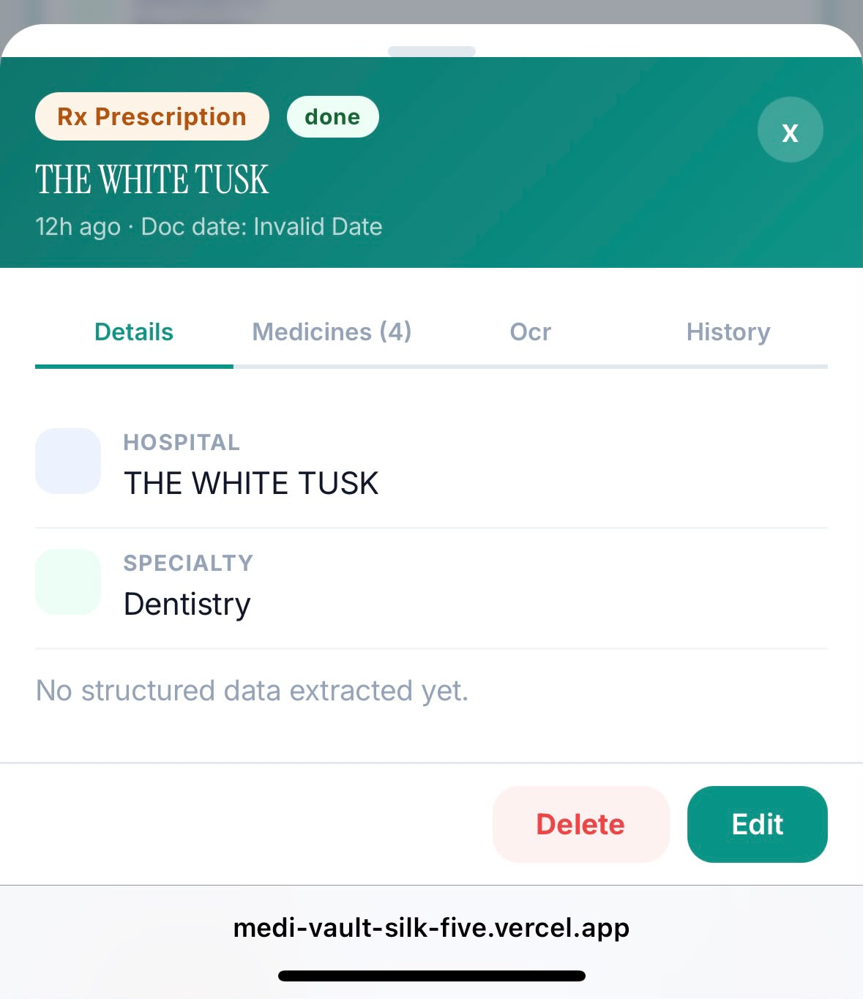
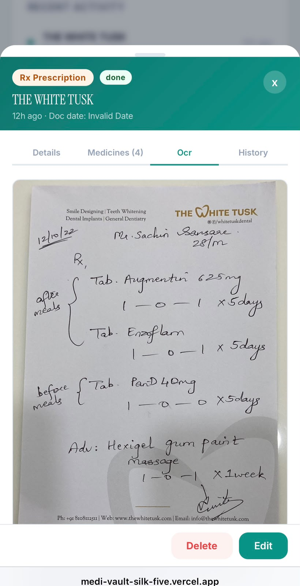
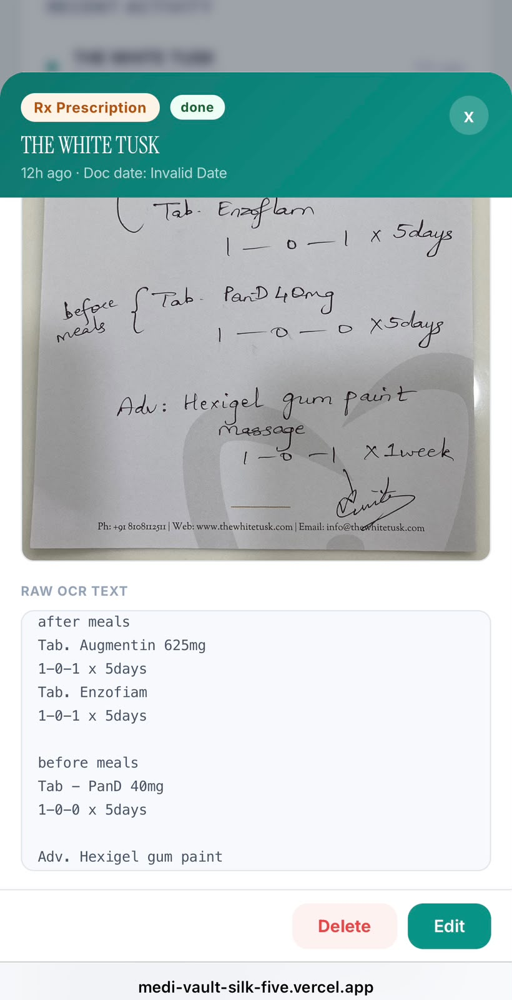
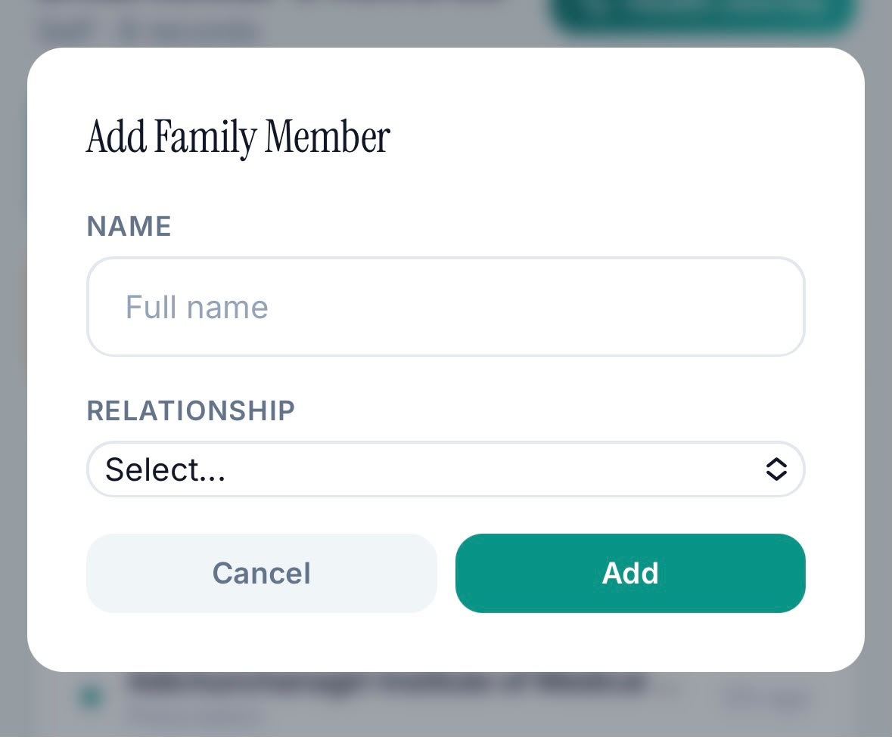
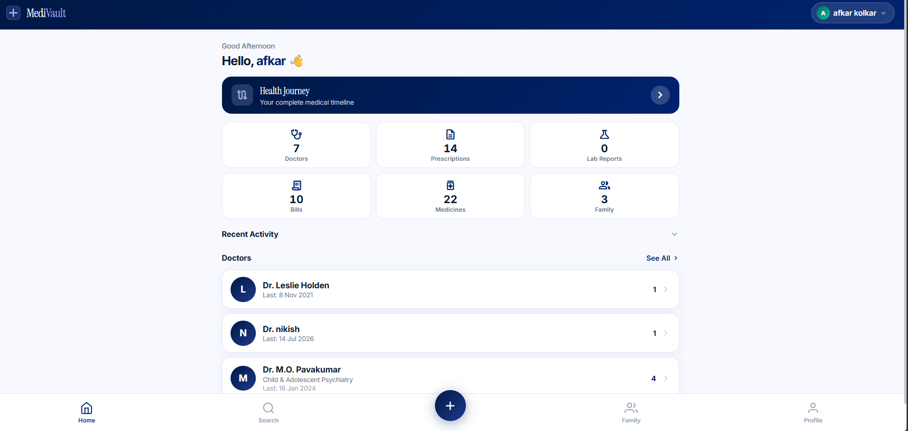
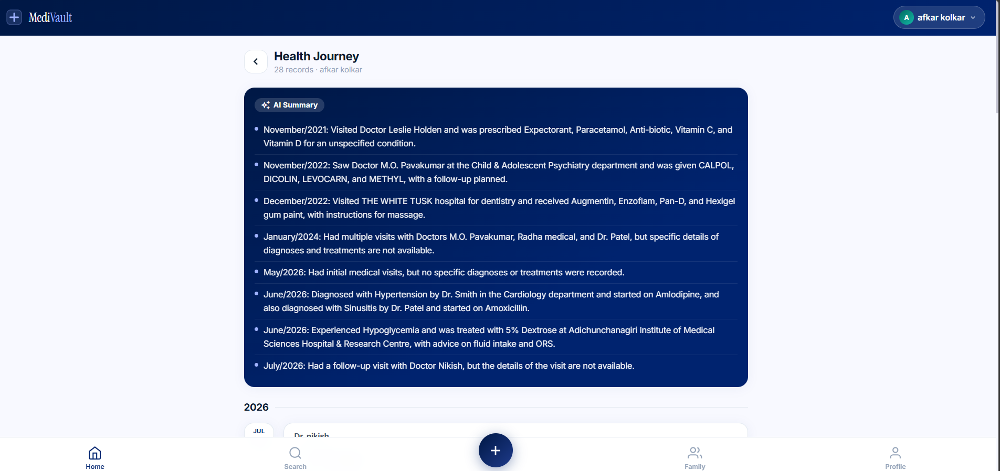

<p align="center">
  
</p>

<p align="center">
  <a href="https://github.com/Afkar085/MediVault/actions/workflows/ci.yml"></a>
</p>

<h1 align="center">MediVault</h1>

<p align="center">
  <strong>AI-powered family medical records manager</strong><br/>
  Upload any prescription — even handwritten. AI reads it, extracts everything, and makes it searchable.
</p>

<p align="center">
  <a href="https://medi-vault-silk-five.vercel.app/">Live Demo</a>
</p>

---

## Screenshots

### Mobile

<table>
  <tr>
    <td width="25%"></td>
    <td width="25%"></td>
    <td width="25%"></td>
    <td width="25%"></td>
  </tr>
  <tr>
    <td align="center">Login</td>
    <td align="center">Dashboard</td>
    <td align="center">Records & Search</td>
    <td align="center">AI Health Journey</td>
  </tr>
</table>

<table>
  <tr>
    <td width="25%"></td>
    <td width="25%"></td>
    <td width="25%"></td>
    <td width="25%"></td>
  </tr>
  <tr>
    <td align="center">Record Details</td>
    <td align="center">Handwritten Rx Scan</td>
    <td align="center">Extracted OCR Text</td>
    <td align="center">Add Family Member</td>
  </tr>
</table>

### Desktop

<table>
  <tr>
    <td></td>
    <td></td>
  </tr>
  <tr>
    <td align="center"><strong>Sign In</strong></td>
    <td align="center"><strong>Dashboard</strong></td>
  </tr>
</table>

---

## What It Does

MediVault lets families store their complete medical history in one place. Take a photo of any prescription — printed or handwritten — and the AI extracts the doctor's name, medicines with dosages, diagnosis, hospital, and specialty. Records are automatically grouped into doctor visits. Bills, lab reports, and prescriptions from the same visit stay together even when uploaded on different days.

---

## Features

**AI Document Processing**
- Reads handwritten and printed prescriptions, lab reports, bills, discharge summaries
- Extracts doctor name, hospital, specialty, diagnosis, medicines (name, dosage, schedule)
- Works with any photo or PDF

**Doctor Visit Timeline**
- Records grouped by doctor and visit date automatically
- One visit holds prescriptions, lab reports, and multiple bills — even uploaded on different days
- Full visit history per doctor, chronological

**Bills & Insurance Tracking**
- Per-bill title, category (Consultation Fee, Pharmacy, Lab Test, Surgery, and more), bill number, amount
- Insurance claimed toggle per bill
- Running total of claimed vs unclaimed per visit

**Medicines Database**
- Structured medicine data — type, dosage schedule (morning / afternoon / night), SOS flag, duration

**Family Profiles**
- Independent medical timeline for each family member
- Switch between profiles instantly from the top bar

**Smart Search**
- Instant search across doctor name, hospital, diagnosis, specialty, medicines
- Category filter chips — Prescriptions, Lab Reports, Bills, Medicines

**AI Health Journey**
- AI-generated bullet-point summary of a profile's entire health history
- Tracks diagnoses, treatment progression, medication changes

**Edit History**
- Every field change logged with old → new value and timestamp

---

## Tech Stack

| Layer | Technology |
|---|---|
| Frontend | React 19, custom CSS (no UI library) |
| Backend | FastAPI, Pydantic v2 |
| Database | PostgreSQL via Supabase |
| File Storage | Supabase Storage |
| OCR | Groq — `llama-3.2-11b-vision-preview` |
| AI Extraction | Groq — `llama-3.3-70b-versatile` |
| Auth | JWT + bcrypt |
| Frontend Hosting | Vercel |
| Backend Hosting | Railway |

---

## How the AI Pipeline Works

```
Upload photo or PDF
        ↓
Groq Vision reads raw text from the image
(handles handwriting, stamps, mixed formats)
        ↓
Second AI pass extracts structured fields:
  doctor, hospital, date, specialty, diagnosis,
  recommendations, medicines with dosages
        ↓
Record saved and shown instantly
        ↓
When uploading inside a visit — date is enforced
post-OCR so the document stays in the right visit
```

---

## Architecture

```
React 19 (Vercel)
    │ HTTPS + JWT
FastAPI (Railway)
    │ background OCR tasks
    ├── Groq Vision  →  raw text
    └── Groq Llama / GPT-OSS  →  structured data
    │
Supabase (PostgreSQL + Storage)
```

---

## Future Roadmap

- [ ] Semantic search + "Ask Your Records" (RAG) — built on a feature branch (hybrid keyword + vector search via pgvector, grounded Q&A with citations), held back from this deploy pending the pgvector migration and a resource check on the hosting tier
- [ ] Bill PDF export and share
- [ ] Prescription refill reminders
- [ ] Lab result trend graphs (haemoglobin, blood sugar over time)
- [ ] Full medical history export as PDF
- [ ] Multi-language OCR
- [ ] Medication interaction checker
- [ ] Appointment scheduling
- [ ] Insurance claim status tracking (Pending / Submitted / Approved)

---

## Author

**Afkar** — [GitHub @Afkar085](https://github.com/Afkar085)

---

<p align="center">
  <a href="https://medi-vault-silk-five.vercel.app/">Try MediVault Live</a>
</p>

<p align="center">
  React 19 · FastAPI · PostgreSQL · Supabase · Groq AI · Vercel · Railway
</p>
