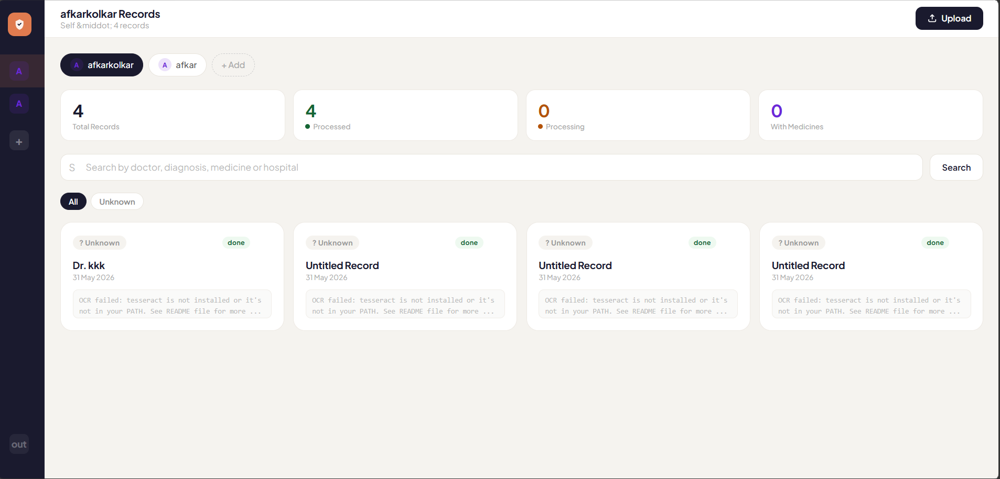
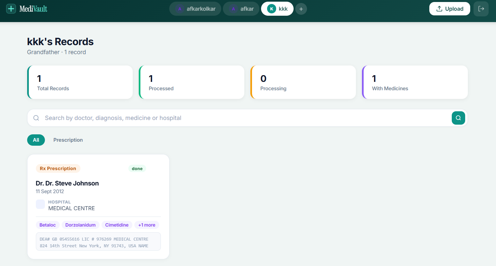
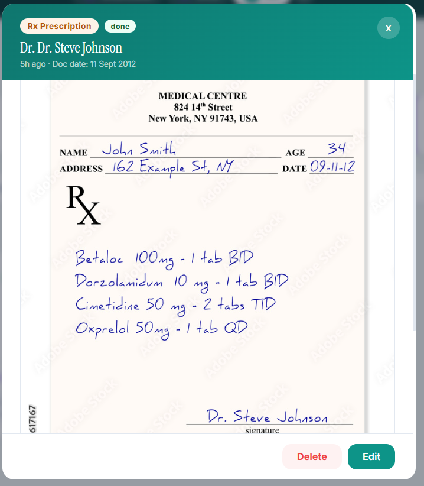
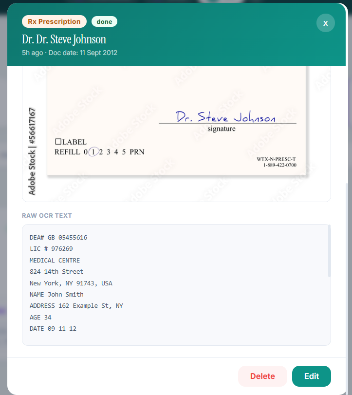
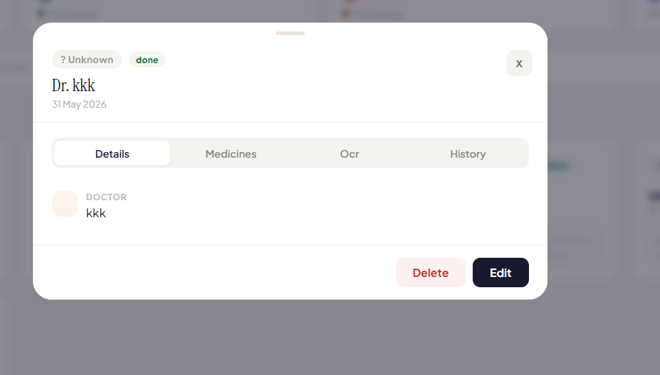
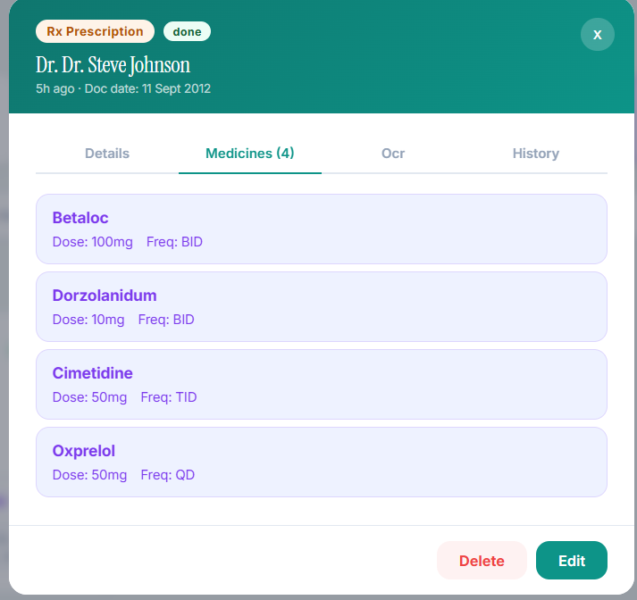

<p align="center">
  
</p>

<h1 align="center">MediVault</h1>

<p align="center">
  <strong>AI-powered family medical records manager</strong><br/>
  Upload prescriptions. AI extracts everything. Search instantly.
</p>

<p align="center">
  <a href="https://medi-vault-silk-five.vercel.app/">Live Demo</a>
</p>

---

## What is MediVault?

MediVault is a full-stack healthcare application that lets families store, organize, and search their complete medical history. Upload a prescription photo — even handwritten ones — and MediVault's AI reads the document, extracts doctor names, diagnoses, medicines with dosages, hospitals, and more. Everything becomes instantly searchable.

Built for real families managing health records across multiple members and doctors over years.

## Screenshots

### Dashboard & Records


### Multi-Profile — Family Health Management


### AI OCR — Reads Handwritten Prescriptions
| Scanned Document | Extracted Data |
|---|---|
|  |  |

### Record Details & Medicines
| Structured Details | Extracted Medicines |
|---|---|
|  |  |

## Key Features

**AI-Powered Document Processing**
- Upload any prescription, lab report, or medical document (image or PDF)
- AI vision model reads the document — including handwritten text
- Automatically extracts: doctor name, hospital, specialty, diagnosis, medicines (name, dosage, frequency), recommendations, document date

**Family Medical Profiles**
- Create profiles for each family member (Self, Father, Mother, Children, etc.)
- Each profile maintains its own complete medical timeline
- Switch between profiles instantly

**Doctor Visit Timeline**
- Records automatically group by doctor
- View complete visit history with any doctor
- Track treatment progression over time
- Compare any two visits side-by-side (medicines added/removed/continued)

**Smart Search**
- Search across everything: doctors, medicines, hospitals, diagnoses, departments, family members
- Search by date — type "2026" or "June" to find records from that period
- Category filters: Doctor, Medicine, Hospital, Diagnosis, Family, Department, Date
- Results ranked by relevance

**AI Health Journey**
- AI-generated summary of each family member's health timeline
- Tracks treatment progression, medication changes, follow-up outcomes
- Helps patients understand their health history at a glance

**Production Features**
- JWT authentication with bcrypt password hashing
- Edit audit trail — every change to a record is logged
- Responsive design — works on desktop, tablet, and mobile
- Real-time OCR status tracking with background processing
- Error recovery with meaningful messages

## Architecture

```
┌──────────────────────────────────────────────────┐
│                   Frontend                        │
│              React 19 (Vercel)                    │
│                                                   │
│  Auth ──── Dashboard ──── Records ──── Search     │
│              │               │           │        │
│         Profile Switcher  Doctor View  Category   │
│         Health Journey    Compare      Filters    │
└──────────────────┬───────────────────────────────┘
                   │ HTTPS / JWT
┌──────────────────┴───────────────────────────────┐
│                   Backend                         │
│             FastAPI (Railway)                      │
│                                                   │
│  /auth ─── /profiles ─── /upload ─── /search      │
│                              │                    │
│                    ┌─────────┴──────────┐         │
│                    │  Background Task   │         │
│                    │                    │         │
│              ┌─────┴─────┐    ┌────────┴───┐     │
│              │  OCR      │    │  AI Extract │     │
│              │  (Groq    │    │  (Groq      │     │
│              │  Vision)  │    │  Llama 70B) │     │
│              └───────────┘    └─────────────┘     │
└──────────────────┬───────────────────────────────┘
                   │
┌──────────────────┴───────────────────────────────┐
│                 Supabase                          │
│                                                   │
│  PostgreSQL          Storage (S3)                 │
│  ├─ users            └─ medical-records/          │
│  ├─ profiles             ├─ {user}/{profile}/     │
│  ├─ records              └─ {uuid}.{ext}          │
│  ├─ medicines                                     │
│  └─ record_edits                                  │
└──────────────────────────────────────────────────┘
```

## Database Design

| Table | Purpose |
|---|---|
| `users` | Authentication (email, hashed password) |
| `profiles` | Family members per user (name, relationship) |
| `records` | Medical documents (doctor, hospital, diagnosis, OCR text, file URL, status) |
| `medicines` | Extracted medications (name, dosage, frequency, duration) per record |
| `record_edits` | Audit trail for every field change with timestamps |

## AI Processing Pipeline

```
Upload Image/PDF
      │
      ▼
  Store in Supabase Storage
      │
      ▼
  Groq Llama Vision (OCR)
  ─ Reads text from image
  ─ Handles handwriting, stamps, forms
      │
      ▼
  Groq Llama 3.3 70B (Extraction)
  ─ Parses OCR text into structured JSON
  ─ Identifies: document type, doctor, hospital,
    date, specialty, diagnosis, recommendations
  ─ Extracts medicines with dosage & frequency
      │
      ▼
  Store in PostgreSQL
  ─ Record metadata updated
  ─ Medicines inserted
  ─ Status → "done"
```

## Tech Stack

| Layer | Technology |
|---|---|
| Frontend | React 19 |
| Backend | FastAPI, Pydantic |
| Database | PostgreSQL (Supabase) |
| File Storage | Supabase Storage |
| OCR | Groq Llama 4 Scout Vision |
| AI Extraction | Groq Llama 3.3 70B |
| AI Health Journey | Groq Llama 3.3 70B |
| Auth | JWT + bcrypt |
| Frontend Hosting | Vercel |
| Backend Hosting | Railway |

## Challenges Solved

**Handwritten prescription OCR** — Most OCR services fail on handwritten medical documents. MediVault uses Groq's multimodal vision model which reads handwriting, stamps, and mixed-format medical documents reliably.

**Structured extraction from unstructured text** — Raw OCR output is messy. A second AI pass with a carefully designed prompt extracts structured fields (doctor, medicines with dosages, diagnosis) from the noise.

**Family-scale medical records** — Real families visit dozens of doctors across years. MediVault's doctor timeline view and visit comparison make it possible to track treatment progression without losing context.

**Smart search across everything** — Searching "fever" finds related diagnoses. Searching "Crocin" finds every prescription containing it. Searching "2026" finds visits from that year. Searching "Father" shows Father's records across all doctors.

## Future Roadmap

- Export medical records as PDF summary
- Medication reminders and follow-up alerts
- Doctor-side portal for sharing records
- Multi-language OCR support
- Offline mode with sync
- HIPAA-compliant deployment option
- Integration with pharmacy systems for refill tracking

## Live Demo

Try MediVault: [medi-vault-silk-five.vercel.app](https://medi-vault-silk-five.vercel.app/)

## Built With

React 19 · FastAPI · PostgreSQL · Supabase · Groq AI · Vercel · Railway
