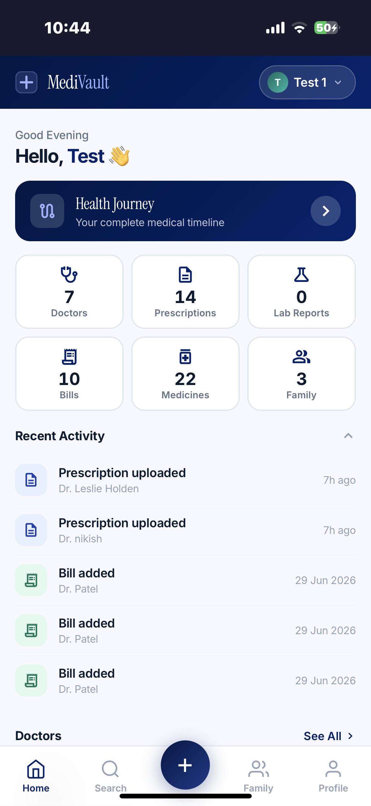
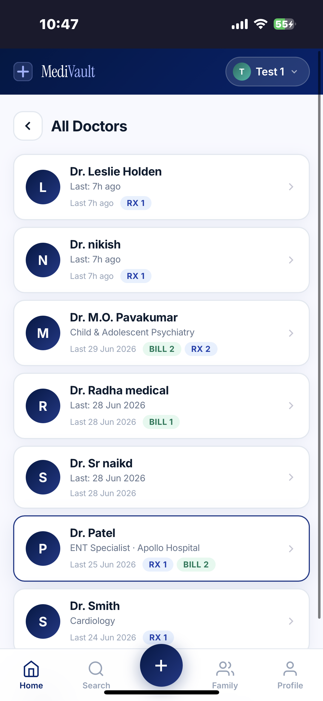
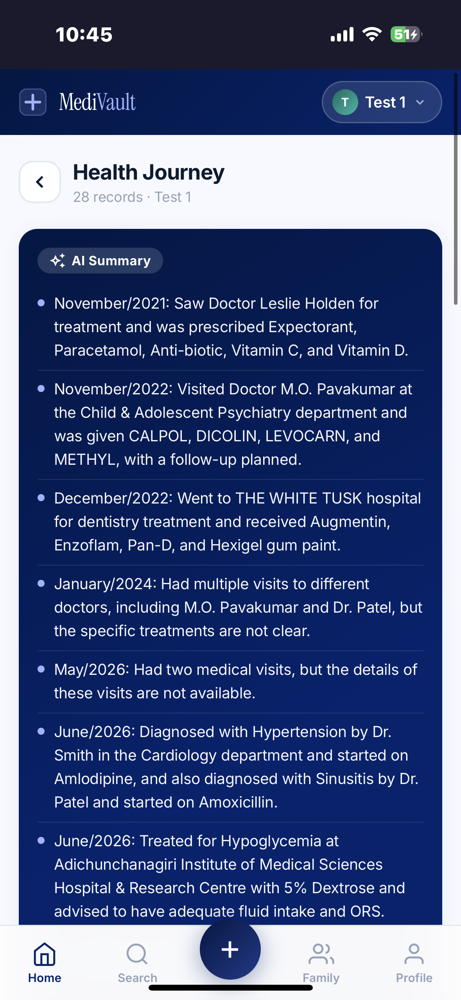
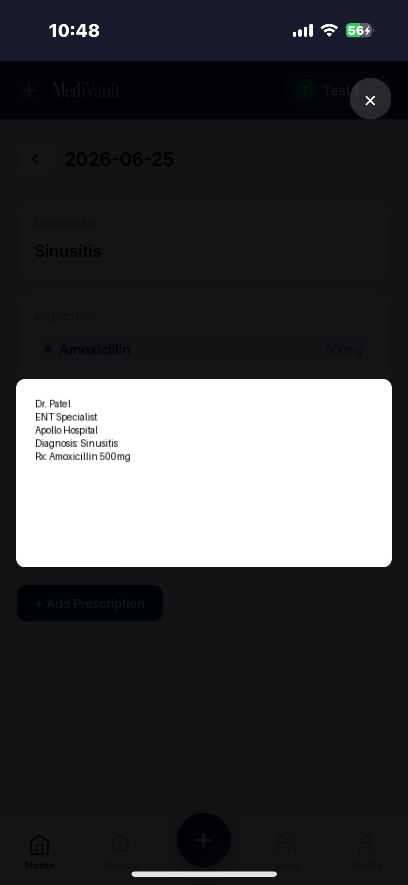
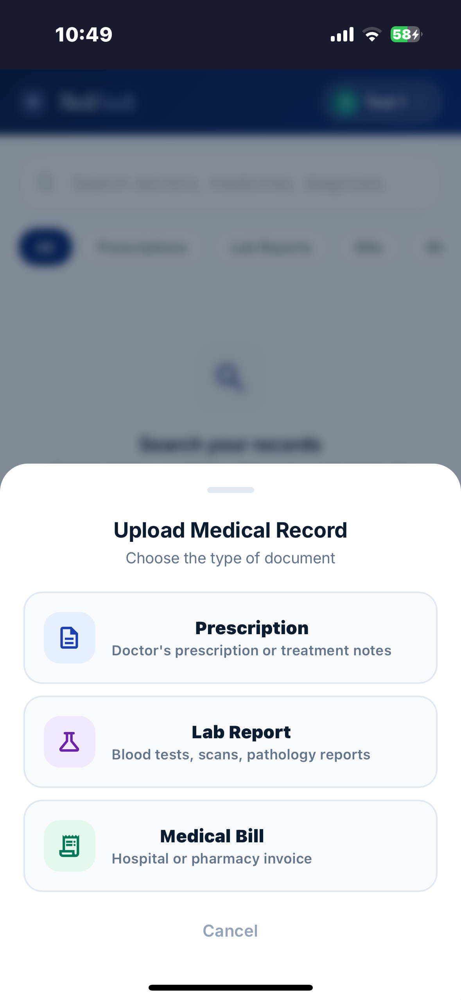
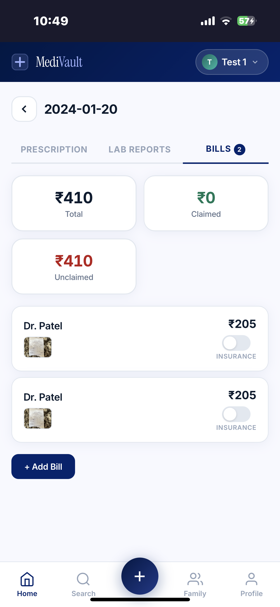
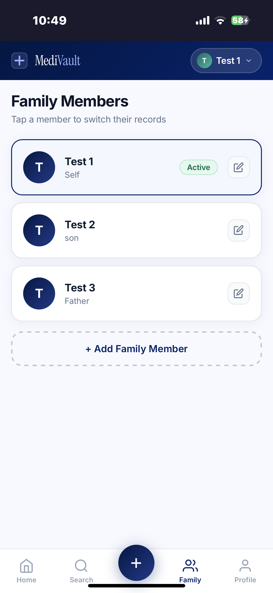
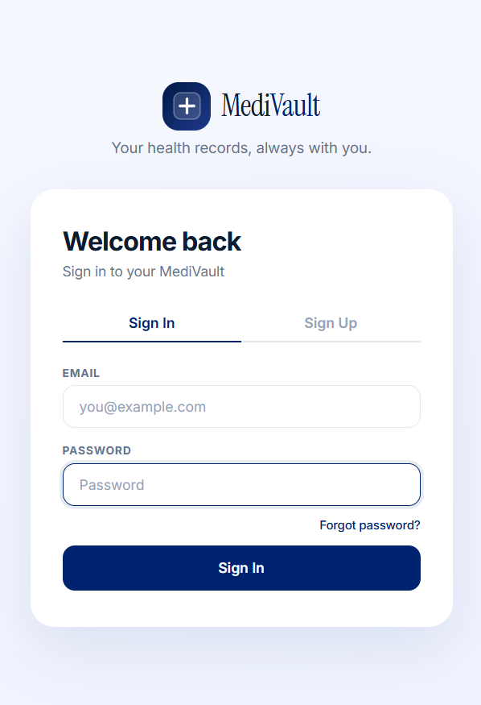
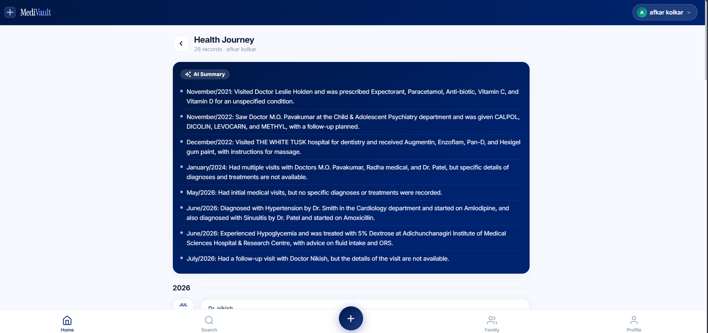
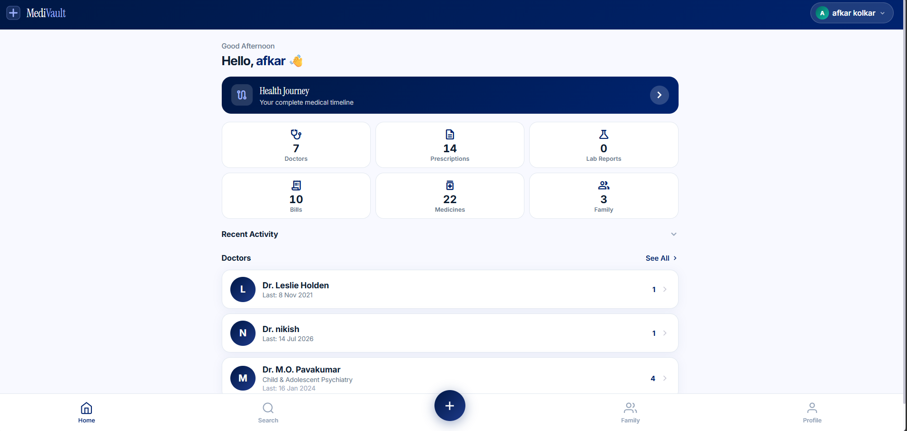

<p align="center">
  
</p>

<p align="center">
  <a href="https://github.com/Afkar085/MediVault/actions/workflows/ci.yml"></a>
</p>

<h1 align="center">MediVault</h1>

<p align="center">
  <strong>AI-powered family medical records manager</strong><br/>
  Upload any prescription — even handwritten. AI reads it, extracts everything, and makes it searchable.
</p>

<p align="center">
  <a href="https://medi-vault-silk-five.vercel.app/">Live Demo</a>
</p>

---

## Screenshots

### Mobile

<table>
  <tr>
    <td width="25%"></td>
    <td width="25%"></td>
    <td width="25%"></td>
  </tr>
  <tr>
    <td align="center">Dashboard</td>
    <td align="center">Doctors</td>
    <td align="center">AI Health Journey</td>
  </tr>
</table>

<table>
  <tr>
    <td width="25%"></td>
    <td width="25%"></td>
    <td width="25%"></td>
    <td width="25%"></td>
  </tr>
  <tr>
    <td align="center">Record Details</td>
    <td align="center">Upload Flow</td>
    <td align="center">Bills & Insurance</td>
    <td align="center">Family Members</td>
  </tr>
</table>

### Desktop

<table>
  <tr>
    <td></td>
    <td></td>
    <td></td>
  </tr>
  <tr>
    <td align="center"><strong>Sign In</strong></td>
    <td align="center"><strong>Health Journey</strong></td>
    <td align="center"><strong>Dashboard</strong></td>
  </tr>
</table>

---

## What It Does

MediVault lets families store their complete medical history in one place. Take a photo of any prescription — printed or handwritten — and the AI extracts the doctor's name, medicines with dosages, diagnosis, hospital, and specialty. Records are automatically grouped into doctor visits. Bills, lab reports, and prescriptions from the same visit stay together even when uploaded on different days.

---

## Features

**AI document processing**
- Reads handwritten and printed prescriptions, lab reports, bills, discharge summaries
- Extracts doctor name, hospital, specialty, diagnosis, medicines (name, dosage, schedule)
- Works with any photo or PDF; files are checked on the device before upload, so an
  unsupported or oversized file is rejected immediately rather than after a long upload
- A document that fails processing says so and explains what to try, instead of sitting
  on "Processing" forever

**Doctor visit timeline**
- Records grouped by doctor and visit date automatically
- One visit holds prescriptions, lab reports, and multiple bills — even uploaded on different days
- Full visit history per doctor, chronological

**Bills & insurance tracking**
- Per-bill title, category (Consultation Fee, Pharmacy, Lab Test, Surgery, and more), bill number, amount
- Insurance claimed toggle per bill
- Running total of claimed vs unclaimed per visit

**Medicines**
- Structured medicine data — type, dosage schedule (morning / afternoon / night), SOS flag, duration

**Family profiles**
- Independent medical timeline for each family member
- Switch between profiles from the top bar; records are never shown under the wrong name,
  even when switching faster than the network responds

**Retrieval**
- Structured search ranks records; passage retrieval finds the text inside them. Both are
  used where they are better, per the question
- Semantic matching via pgvector when the embedding model is available; term-overlap
  ranking when it is not. Nothing about the feature disappears on a small host — semantic
  matching just becomes literal matching
- Records indexed before and after the passage migration are both searched, so applying it
  never hides existing history

**Find — structured search**
- Server-side ranking across doctor, hospital, department, diagnosis, medicines, the scanned
  document text, and dates ("June", "2026")
- Search one member or the whole family, with each result labelled by owner
- Semantic search fuses in via pgvector when the embedding model is available, and degrades
  to keyword ranking when it is not

**Ask — questions in plain words**
- "What medicines was Dad prescribed for his knee?" · "When was Mum's last blood test?"
  · "What was my haemoglobin?"
- Grounded in the documents themselves, not only the extracted fields. Each document is
  split into passages, and the passages relevant to the question are quoted to the model —
  so a lab value or a specific instruction that was never extracted into a column can still
  be answered, and quoted back
- Every answer lists the records it used. Each citation shows the excerpt it came from and
  opens that record, including when it belongs to a different family member
- Backed by a bounded tool-calling loop over seven read-only tools (family members,
  records, medication history, test history, timeline, document passages, record details)
- Never diagnoses and never advises changing treatment; if the records do not contain the
  answer, it says so rather than guessing, and it is told never to round or estimate a figure

**AI health journey**
- Bullet-point summary of a profile's entire health history
- Cached against the records that produced it, so reopening the screen is instant and
  costs nothing; any upload or edit regenerates it

**Edit history**
- Every field change logged with old → new value and timestamp

**Accessibility**
- Every row and control is reachable and operable from a keyboard, with visible focus
- Every overlay is a real dialog: focus moves into it, Tab stays inside it, Escape closes
  it, and focus returns to whatever opened it
- Icons are hidden from screen readers so controls announce their own label
- Pinch-zoom works — the documents are photographs, and reading small print matters
- Touch targets sized for a fingertip; verified at 320px through 1920px

**Behaves on a small host**
- Multi-page uploads read their pages concurrently instead of one after another
- The health-journey summary is cached against the records that produced it, so reopening
  it is instant and costs nothing until something changes
- A free-tier backend sleeps when idle and takes up to a minute to wake. Reads are retried
  patiently and the app says what is happening, instead of reporting itself broken

**Security**
- Documents are only ever served through short-lived signed URLs generated per request;
  no public URL is stored anywhere
- Storage object keys are derived from the verified file type, never the uploaded filename
- Rate limits on every endpoint that issues credentials or calls a model
- Restricted CORS and security headers (HSTS, CSP, X-Frame-Options) on every response
- Server-side file-content validation on upload (checks the actual bytes, not the claimed type)
- Startup refuses a JWT secret under 32 characters; registration requires a real password
- The AI reaches data only through tools bound to the signed-in user's own profiles —
  no tool takes a user id, runs SQL, or can widen its own scope
- Full account deletion, cascading through every family profile and document

---

## Running it locally

```bash
git clone https://github.com/Afkar085/MediVault.git
cd MediVault
```

**Backend**

```bash
cd backend
python -m venv .venv && .venv/Scripts/activate      # macOS/Linux: source .venv/bin/activate
pip install -r requirements-dev.txt
cp .env.example .env                                 # then fill it in
uvicorn app.main:app --reload
```

`backend/.env.example` lists every required variable. `JWT_SECRET` must be at least 32
characters — the app refuses to start otherwise:

```bash
python -c "import secrets; print(secrets.token_urlsafe(48))"
```

**Frontend**

```bash
cd frontend
npm install
echo REACT_APP_API_URL=http://localhost:8000/api/v1 > .env.local
npm start
```

**Checks**

```bash
cd backend && ruff check app tests && pytest -q
cd frontend && CI=true npm test -- --watchAll=false && CI=true npm run build
```

Both run in CI on every push. The frontend build treats lint warnings as errors.

---

## Deployment steps that cannot be done from code

These need the Supabase and hosting dashboards:

1. **Use the service_role key.** Set `SUPABASE_KEY` on the backend host to the project's
   service_role key (Project Settings → API), then redeploy and confirm the app still works.
2. **Then** run `backend/database/migrations/002_security_advisor_fixes.sql` in the Supabase
   SQL editor. It enables deny-all RLS on all six tables, closing the public REST API.
   Running it *before* step 1 will break the app — the order matters.
3. Run `backend/database/migrations/003_private_document_urls.sql` to clear the public
   document URLs stored by older uploads. `file_path` is untouched, so nothing becomes
   unreachable.
4. **Set the `medical-records` bucket to private** (Storage → bucket settings). The app only
   hands out signed URLs, but a public bucket means anyone who ever saw a URL keeps access.
5. Set `ALLOWED_ORIGINS` on the backend host to the deployed frontend URL, so CORS is
   actually restricted.
6. Optional — semantic search: run `001_semantic_search.sql` and `004_document_passages.sql`,
   and install `requirements-rag.txt`. These need more RAM than a 512MB tier provides.
   Without them, search and Ask fall back to term-overlap ranking and passages are computed
   from the stored document text on the fly — everything still works, matching is just
   literal rather than semantic. Applying them later is safe: records without stored
   passages continue to be searched.

**Not implemented:** password reset by email. It needs an email provider, which is a paid
infrastructure decision. The sign-in screen says so plainly rather than pretending to send
a link.

## Design System

A deliberate visual identity rather than default styling — deep navy primary with a restrained teal secondary, a consistent 4-color semantic system for document categories (prescriptions, lab reports, bills, discharge summaries) used identically across every screen, and real iconography (Google Material Symbols) throughout instead of emoji.

---

## Tech Stack

| Layer | Technology |
|---|---|
| Frontend | React 19, custom CSS (no UI library) |
| Backend | FastAPI, Pydantic v2 |
| Database | PostgreSQL via Supabase |
| File Storage | Supabase Storage (private bucket, signed URLs) |
| OCR | Groq — `qwen/qwen3.6-27b` (vision) |
| AI extraction, summaries & answers | Groq — `openai/gpt-oss-120b` (env-driven via `GROQ_TEXT_MODEL`) |
| Auth | JWT + bcrypt |
| Retrieval | Document passages + pgvector (optional), fused with keyword ranking via RRF |
| Testing | pytest + ruff (backend), Jest + Testing Library (frontend), GitHub Actions CI |
| Frontend Hosting | Vercel |
| Backend Hosting | Render |

---

## How the AI Pipeline Works

```
Upload photo or PDF
        ↓
Groq Vision reads raw text from the image
(handles handwriting, stamps, mixed formats)
        ↓
Second AI pass extracts structured fields:
  doctor, hospital, date, specialty, diagnosis,
  recommendations, medicines with dosages
        ↓
Record saved and shown instantly
        ↓
When uploading inside a visit — date is enforced
post-OCR so the document stays in the right visit
```

---

## Architecture

```
React 19 (Vercel)
    │ HTTPS + JWT
FastAPI (Render)
    │ background OCR tasks
    ├── Groq Vision (Qwen3.6 27B)  →  raw text  (pages read concurrently)
    └── Groq gpt-oss-120b  →  structured data, summaries, tool-calling answers
    │
Supabase (PostgreSQL + private Storage)
    ├── records            →  extracted fields + optional record embedding
    └── document_passages  →  the document text, chunked, optionally embedded
```

---

## Roadmap

- [ ] Bill PDF export and share
- [ ] Prescription refill reminders
- [ ] Lab result trend graphs (haemoglobin, blood sugar over time)
- [ ] Full medical history export as PDF
- [ ] Multi-language OCR
- [ ] Password reset by email (needs an email provider)
- [ ] Appointment scheduling
- [ ] Insurance claim status tracking (Pending / Submitted / Approved)

---

## Author

**Afkar** — [GitHub @Afkar085](https://github.com/Afkar085)

---

<p align="center">
  <a href="https://medi-vault-silk-five.vercel.app/">Try MediVault Live</a>
</p>

<p align="center">
  React 19 · FastAPI · PostgreSQL · Supabase · Groq AI · Vercel · Render
</p>
